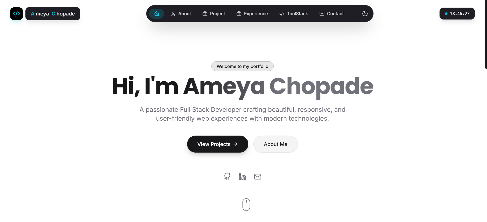
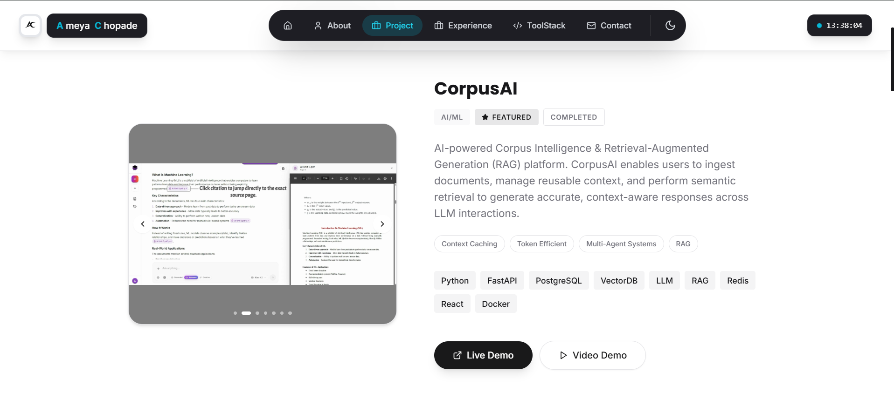

# Ameya's Interactive 3D Portfolio

Welcome to the source code of my personal portfolio website! This project is a showcase of my skills, projects, and professional experience, brought to life with interactive 3D graphics and smooth animations.

## 📸 Preview

| Home | Project Showcase |
|:---:|:---:|
|  |  |

## 🌟 Overview

The portfolio is designed to provide an engaging and immersive user experience. It features:
- Interactive 3D elements powered by **Three.js** and **React Three Fiber**.
- Seamless page transitions and micro-interactions using **Framer Motion**.
- A clean, accessible, and responsive UI built with **Shadcn UI** and **Tailwind CSS**.
- Fully functional contact forms with **EmailJS** integration.

## 🛠️ Built With

- **React** & **TypeScript**
- **Vite**
- **Three.js** / React Three Fiber / Drei
- **Tailwind CSS** & Shadcn UI
- **Framer Motion**

---

*Thank you for visiting! Feel free to explore my live portfolio at [Ameya Portfolio](https://ameyac11.in).*
